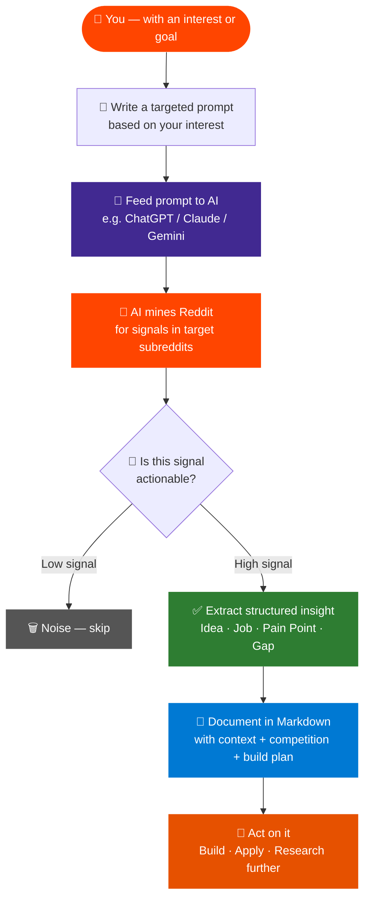
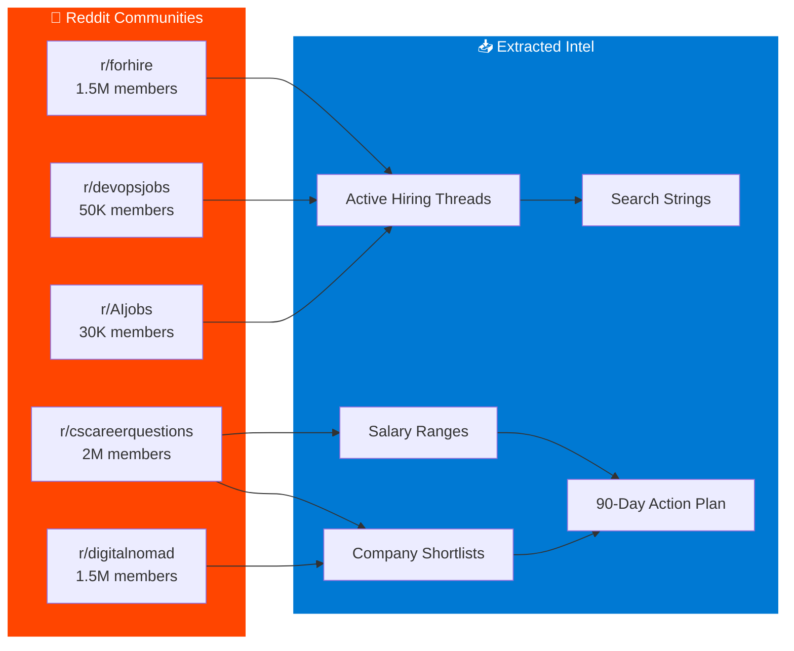
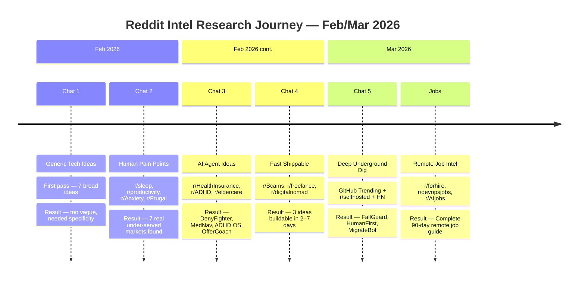

<div align="center">


# Reddit Intelligence System

**A personal research engine that turns Reddit into your idea mine, job board, and opportunity radar**

*Using AI-powered prompts to extract what actually matters from Reddit — startup ideas, real pain points, freelance signals, and remote jobs*

---

[](https://reddit.com)
[](https://openai.com)
[](Ideas_Reddit/)
[](Reddit_JobSearch/)
[](Reddit_JobSearch/Remote_Tech_Jobs_Guide.md)
[](LICENSE)

</div>

---

## 💡 What Is This?

Most people scroll Reddit. This system **reads Reddit differently**.

Instead of browsing for entertainment, we use targeted AI prompts to extract:

- 🚀 **Startup ideas** hiding inside complaint threads
- 🔥 **Human pain points** that nobody has built a product for yet
- 💼 **Remote job signals** from hiring communities
- 🧠 **Market gaps** disguised as "is there an app for this?" posts
- 🤝 **Co-founder asks, freelance gigs, beta tester requests**

> The insight isn't the Reddit post. The insight is the *pattern* across hundreds of them — and AI reads those patterns instantly.

---

## 🗂️ What's In This Repository

```
📁 Ideas_Reddit/           ← AI research sessions — pain points + startup ideas
📁 Reddit_JobSearch/       ← Reddit-sourced remote job intelligence for tech roles
📄 README.md               ← You're here
```

| File | What's Inside | Signal Count |
|------|--------------|:---:|
| [`Ideas_Reddit/chat1_generic_tech_ideas.md`](Ideas_Reddit/chat1_generic_tech_ideas.md) | First pass — broad tech ideas | 7 |
| [`Ideas_Reddit/chat2_human_painpoints.md`](Ideas_Reddit/chat2_human_painpoints.md) | Non-tech pain points with market gaps | 7 |
| [`Ideas_Reddit/chat3_ai_agent_ideas.md`](Ideas_Reddit/chat3_ai_agent_ideas.md) | High-stakes AI agent opportunities | 5 |
| [`Ideas_Reddit/chat4_fast_shippable_ideas.md`](Ideas_Reddit/chat4_fast_shippable_ideas.md) | Specific 2–7 day build targets | 3 |
| [`Ideas_Reddit/chat5_deep_dive_github_hn.md`](Ideas_Reddit/chat5_deep_dive_github_hn.md) | Deep underground: GitHub + HN + niche Reddit | 5 ⭐ |
| [`Ideas_Reddit/reddit_painpoints.md`](Ideas_Reddit/reddit_painpoints.md) | Original pain points with competitive landscape | 7 |
| [`Ideas_Reddit/INDEX.md`](Ideas_Reddit/INDEX.md) | Master index of all 20+ extracted ideas | All |
| [`Reddit_JobSearch/Remote_Tech_Jobs_Guide.md`](Reddit_JobSearch/Remote_Tech_Jobs_Guide.md) | Complete remote job guide — DevOps, AI/ML, Cloud | Full Guide |

---

## ⚙️ How The System Works



---

## 🎯 Interest → Signal Type → Output

The system adapts to **what you want to find**. You guide it with your interest:

| 🎯 Your Interest | 🔴 Reddit Sources Mined | 💡 What You Get |
|-----------------|------------------------|-----------------|
| Building a startup | r/startups, r/Entrepreneur, r/AppIdeas, r/SideProject | Validated ideas with gap analysis + competition map |
| Finding pain points | r/sleep, r/productivity, r/ADHD, r/freelance, r/legaladvice | Real user frustrations nobody has solved yet |
| Remote tech jobs | r/forhire, r/devopsjobs, r/AIjobs, r/cscareerquestions | Hiring threads, salary data, search strategies |
| Building with AI | r/MachineLearning, r/artificial, r/LocalLLaMA, r/SideProject | Open-source repos trending + unbuilt AI tools |
| Freelance work | r/freelance, r/hiring, r/forhire | Active contracts, rates, client red flags |
| Market research | Any niche subreddit | What people hate, what they pay for, what's missing |

---

## 🔥 Real Signals Extracted — Examples

What does an extracted signal actually look like? Here are **real ideas** pulled from this research:

<details>
<summary><b>⭐ FallGuard — WiFi Fall Detection for Elderly</b> (from r/eldercare + GitHub Trending)</summary>

**Reddit signal:**
> *"Mom fell at 3am. She was on the floor for 6 hours before I knew. She refuses to wear a medical alert bracelet. I can't put a camera in her bathroom. What are my options?"*

**GitHub signal:** Repo `wifi-densepose` hit 7,220 stars in one week — passive full-body pose estimation using commodity WiFi routers. **No cameras. No wearables.**

**The opportunity: FallGuard**
- Uses WiFi signal interference (CSI data) to detect falls through walls
- AI classifies fall patterns vs. normal movement
- SMS + call alert to family within 30 seconds
- Zero cooperation needed from the elderly person

| Competitor | Problem |
|-----------|---------|
| Life Alert | Must physically press button |
| Apple Watch | $400 device + must wear it |
| Cameras | Invasive, not allowed in bathrooms |
| **FallGuard** | **Fully passive — nothing to wear or press** |

**Market:** 14M elderly Americans living alone × $15/month = **$25M ARR at 1% penetration**
**Build time:** 2–3 weeks with Raspberry Pi + forked open-source repo

📄 Full details: [`chat5_deep_dive_github_hn.md`](Ideas_Reddit/chat5_deep_dive_github_hn.md)

</details>

<details>
<summary><b>⭐ HumanFirst — Proof of Human Layer for Job Applications</b> (from r/recruiting)</summary>

**Reddit signal:**
> *"Applied to 400 jobs in 3 months. 3 responses. The market feels fake. I'm applying into a void."*

**The problem:** AI-generated applications have flooded hiring. Real humans are invisible in the noise. Recruiters can't tell who's genuine.

**The opportunity: HumanFirst**
- A browser extension that adds a verified "human-reviewed" badge to job applications
- Cryptographic proof the application wasn't AI-spammed
- Employers can filter for HumanFirst-verified candidates only

📄 Full details: [`chat5_deep_dive_github_hn.md`](Ideas_Reddit/chat5_deep_dive_github_hn.md)

</details>

<details>
<summary><b>"Is This a Scam?" Instant Analyzer</b> (from r/Scams)</summary>

**Reddit signal:**
> Every single post in r/Scams is a screenshot with "is this a scam?" — people waiting hours for strangers to reply.

**The 2-day build:**
- User pastes suspicious text or forwards a screenshot
- AI returns in 10 seconds: ✅/❌ verdict + scam type + exactly what to do next
- Distribution: post link in r/Scams — the community that proves the need organically

**Available:** WhatsApp bot (Twilio) or single webpage. No database. No accounts.

📄 Full details: [`chat4_fast_shippable_ideas.md`](Ideas_Reddit/chat4_fast_shippable_ideas.md)

</details>

<details>
<summary><b>Freelancer "I Haven't Been Paid" Tool</b> (from r/freelance)</summary>

**Reddit signal:**
> *"Client went silent after I delivered everything. They still owe me $3,400. I don't know what to say."*

This is the **#1 recurring theme in r/freelance every single week.**

**The 3-day build:**
- 4 inputs: amount owed, days overdue, contract exists (y/n), what you delivered
- AI generates: follow-up email + escalation email + final demand letter with legal language + which platform to use
- Free for one letter, $3/month for history + bulk

📄 Full details: [`chat4_fast_shippable_ideas.md`](Ideas_Reddit/chat4_fast_shippable_ideas.md)

</details>

<details>
<summary><b>DenyFighter — Insurance Denial Appeal Generator</b> (from r/HealthInsurance)</summary>

**Reddit signal:**
> *"Insurance denied my MRI again. Third appeal. Each time: 'not medically necessary.' My doctor says it is. I've been in pain for 8 months."*

**The problem:** Insurance companies deny valid claims knowing 80%+ of people give up after the first denial response.

**The AI agent:** Paste denial letter → AI identifies the denial code → pulls peer-reviewed literature for your specific condition → drafts appeal in insurance/legal language → tells you the exact state law protecting you.

📄 Full details: [`chat3_ai_agent_ideas.md`](Ideas_Reddit/chat3_ai_agent_ideas.md)

</details>

<details>
<summary><b>Anti-Optimization Sleep App</b> (from r/sleep)</summary>

**Reddit signal:**
> *"3AM. Heart racing. The more I tried to fix sleep, the worse it got. The problem wasn't being awake — it was FIGHTING being awake."*

**Every existing sleep app makes this worse.** Sleep Cycle gives you a score. Calm tells you to fall asleep. All of them position sleep as a goal to optimize.

**The gap:** Nobody has built a sleep app that tells you to **stop trying**. No graphs. No streaks. No score. Pure nervous system calming with a philosophy of neutrality toward wakefulness.

📄 Full details: [`reddit_painpoints.md`](Ideas_Reddit/reddit_painpoints.md)

</details>

---

## 📋 The Prompts That Power This

The real "secret" of this system is asking AI the right questions. Here are the actual prompt patterns used:

<details>
<summary><b>📌 Pain Point Discovery Prompt</b></summary>

```
Go to [subreddit list]. Look at the top posts from this week.
Find threads where real people describe a recurring frustration,
daily annoyance, or unsolved problem. For each pain point found:

1. Quote the most representative Reddit comment
2. Describe the real underlying problem in one sentence
3. List ALL existing solutions and exactly why they fail this audience
4. Describe what a minimal product fixing this gap would look like
5. Estimate how hard to build (days/weeks) and how to validate demand

Focus on problems that are emotionally loaded, repeated weekly, and have
NO good solution — especially where people say "why doesn't someone build..."
```

</details>

<details>
<summary><b>📌 Fast-Shippable Ideas Prompt</b></summary>

```
I want something specific that can be built and shipped in under 1 week.
Search these subreddits: [list]. Find a thread where:
- The community is actively asking for a tool that doesn't exist
- The problem is narrow enough to solve in a single-page app
- Distribution is built in (the community WOULD share a working solution)
- No database, no accounts, stateless if possible

Give me build plan broken down by day, competitive landscape,
monetization path, and how to post it for organic growth.
```

</details>

<details>
<summary><b>📌 Remote Job Intelligence Prompt</b></summary>

```
Search Reddit for signals about remote work opportunities in [your field].
Cover: r/forhire, r/devopsjobs, r/AIjobs, r/cscareerquestions, r/digitalnomad.

Extract:
1. Active hiring threads posted in last 48 hours
2. Companies mentioned as remote-friendly with good culture
3. Salary ranges being discussed for [role]
4. Which skills are mentioned most in hiring posts
5. Red flags to avoid (companies, contract types)
6. Best search strings to use for daily monitoring
```

</details>

<details>
<summary><b>📌 Deep Underground Dig Prompt</b></summary>

```
Go deeper than surface Reddit. Search:
- GitHub Trending (weekly, any language) for repos getting sudden star spikes
- r/selfhosted, r/degoogle, r/SideProject for tools people are building right now
- Hacker News /ask threads for recurring "is there a tool for..."
- Cross-reference with pain points on matching niche subreddits

Find: a GitHub repo that just exploded in stars + a Reddit community with an
unmet need that repo could theoretically solve. That intersection = product idea.
```

</details>

---

## 💼 Remote Job Intel

The [`Reddit_JobSearch/`](Reddit_JobSearch/) folder contains a complete guide built from Reddit community intelligence:



**Covers:**
- 🔴 Primary subreddits to monitor daily vs. weekly
- 🔍 Exact Reddit search strings that surface real job posts
- 🏢 Companies known to hire globally (remote-first, async-friendly)
- 💰 Salary benchmarks from community discussion threads
- 📅 Realistic 90-day job search action plan
- ⚡ RSS feed setup to get notified instantly when relevant jobs post

📄 Full guide: [`Reddit_JobSearch/Remote_Tech_Jobs_Guide.md`](Reddit_JobSearch/Remote_Tech_Jobs_Guide.md)

---

## 🗺️ Research Journey Map



---

## 🏆 Top Ideas Ranked

| Rank | Idea | Source Signal | Build Time | Revenue Potential |
|:----:|------|--------------|:----------:|:----------------:|
| 🥇 | **FallGuard** — Passive WiFi fall detection | r/eldercare + GitHub | 2–3 weeks | $25M ARR potential |
| 🥈 | **HumanFirst** — Proof of human job layer | r/recruiting | 1 week | Hiring market scale |
| 🥉 | **MigrateBot** — Discord → Matrix migration | r/degoogle (time-sensitive) | 1 week | 150K target users |
| 4 | **RealInbox** — Gmail AI-slop detector | r/selfhosted + r/digitalnomad | 3 days | Chrome extension |
| 5 | **Scam Analyzer** — Instant scam verdict | r/Scams | 2 days | r/Scams viral loop |
| 6 | **DenyFighter** — Insurance appeal writer | r/HealthInsurance | 2 weeks | $30–50/month |
| 7 | **Freelancer Pay Tool** — Invoice escalator | r/freelance | 3 days | Evergreen SaaS |
| 8 | **Anti-Sleep-Optimization App** | r/sleep | 1 month | $8–12/month |
| 9 | **ADHD OS** — Zero-friction task agent | r/ADHD | 3 weeks | Subscription |
| 10 | **Nomad City Matcher** | r/digitalnomad | 1 week | Affiliate + ads |

---

## 🔁 How To Run This For Yourself

<details>
<summary><b>Step 1 — Choose your interest area</b></summary>

Decide what you're looking for:
- 💡 A startup idea to build
- 💼 A job or freelance opportunity
- 🔍 Market research for an existing product
- 🎯 A specific pain point to solve

</details>

<details>
<summary><b>Step 2 — Pick target subreddits</b></summary>

Match your interest to subreddit clusters:

| Goal | Subreddits to Target |
|------|---------------------|
| Startup ideas | r/startups, r/AppIdeas, r/SideProject, r/Entrepreneur |
| Human pain points | r/ADHD, r/sleep, r/productivity, r/Anxiety, r/personalfinance |
| Remote jobs (DevOps/Cloud) | r/devopsjobs, r/forhire, r/cscareerquestions, r/digitalnomad |
| AI / ML opportunities | r/MachineLearning, r/LocalLLaMA, r/artificial, r/SideProject |
| B2B / Freelance | r/freelance, r/hiring, r/smallbusiness, r/consulting |
| Underground signals | r/selfhosted, r/degoogle, GitHub Trending + HN /ask |

</details>

<details>
<summary><b>Step 3 — Run an AI research session</b></summary>

Open ChatGPT, Claude, or Gemini with browsing/search enabled. Use one of the prompt templates in the [Prompts section](#-the-prompts-that-power-this) above.

Be specific. The narrower your prompt, the stronger the signal.

</details>

<details>
<summary><b>Step 4 — Document the output</b></summary>

Create a markdown file for each session. Use this structure:

```markdown
# Chat N — [Topic]
> Sources: r/subreddit1, r/subreddit2
> Date: [date]

## What was asked
[Your exact prompt]

## Pain Point / Idea
**Source:** [specific subreddit + post description]
**Real quote from Reddit:** [paste actual quote]
**The real issue:** [your analysis]
**Available solutions:** [competitive landscape]
**The gap:** [what's missing]
**Build/act plan:** [what to do about it]
```

</details>

<details>
<summary><b>Step 5 — Act on the best signals</b></summary>

- **For ideas:** Validate by posting in the source subreddit, asking if people would use it
- **For jobs:** Use the search strings from the job guide to monitor daily
- **For pain points:** Post a "would you pay for X?" thread before building anything

</details>

---

## 📁 Repository Structure

```
Ideas_from_reddit/
│
├── 📁 Ideas_Reddit/
│   ├── chat1_generic_tech_ideas.md      # Broad first pass
│   ├── chat2_human_painpoints.md        # Non-tech pain points
│   ├── chat3_ai_agent_ideas.md          # High-stakes AI agents
│   ├── chat4_fast_shippable_ideas.md    # 2–7 day builds
│   ├── chat5_deep_dive_github_hn.md     # Deep dig — GitHub + HN
│   ├── reddit_painpoints.md             # Original pain point map
│   └── INDEX.md                         # Master index of all ideas
│
├── 📁 Reddit_JobSearch/
│   └── Remote_Tech_Jobs_Guide.md        # Complete remote job guide
│
└── README.md                            # This file
```

---

## 🔮 What's Next

- [ ] Add research sessions for more subreddit clusters (r/legaladvice, r/personalfinance, r/parenting)
- [ ] Build a validation tracker — which ideas were tested, which showed demand
- [ ] Add prompt templates for product market fit research
- [ ] Document which pain points were validated via subreddit posts
- [ ] Create a job search update tracker (monthly updates to the remote jobs guide)

---

<div align="center">

---

*Reddit is 57 million people talking about their problems every day.*
*This system listens.*

[](https://reddit.com)
[](LICENSE)

</div>
